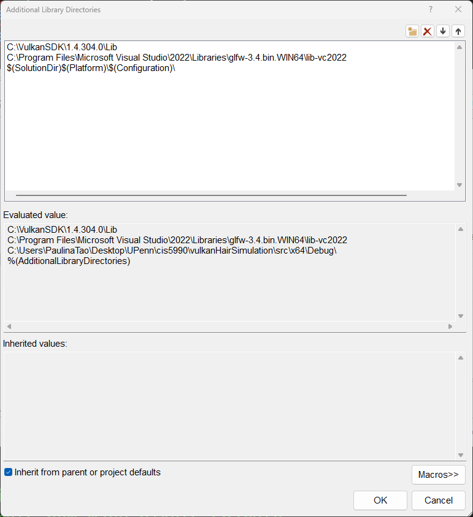

# Vulkan Hair Simulation

## Build
This repository only includes the C++ source and header files. Therefore, to actually run the projects on different platforms, you need to link the libraries after cloning following the [Vulkan tutorial](https://vulkan-tutorial.com/Development_environment).

### Dear ImGui
This project also uses [Dear ImGui](https://github.com/ocornut/imgui). You need to clone the repository and check out to the `docking` branch. Then you need to go to the `imgui` project and add the following files to `Source Files`:
- `imgui.cpp`
- `imgui_draw.cpp`
- `imgui_widgets.cpp`
- `imgui_tables.cpp`
- `imgui_demo.cpp`
- `imgui_impl_glfw.cpp`
- `imgui_impl_vulkan.cpp`

and turn off pre‑compiled headers for the ImGui files (if you use PCH) by:
1. Select all ImGui .cpp files.
2. Right-click and select `Properties`.
3. In the `C/C++` section, select `Precompiled Headers`.
4. Set `Precompiled Header` to `Not Using Precompiled Headers`.

Once you are done, you can simply build the project to generate the static library. You might need to link the vulkan and GLFW libraries to the project as well. The generated library will be located in either the `Debug` or `Release` folder, depending on the configuration you are using. You can then proceed to the main project and:
1. Right-click on the project and select `Properties`.
2. In the `C/C++` section, select `Additional Include Directories`.
3. Add the path to the `imgui` folder.
4. In the `Linker` section, select `Additional Library Directories`.
5. Add `$(SolutionDir)$(Platform)\$(Configuration)\` or where your static library file is located.
6. In the `Linker` section, select `Input`.
7. Add `imgui.lib` to the `Additional Dependencies` field.

### Windows
You'll need to create an empty project in Visual Studio and add the source and header files to the project. Then, you just need to follow the link provided above.

For reference, this is my `C/C++` -> `Additional Include Directories` from `src`'s project properties:

and this is my `Linker` -> `Additional Library Directories`:

### Linux
Currently not supported.

### MacOS
Currently not supported.